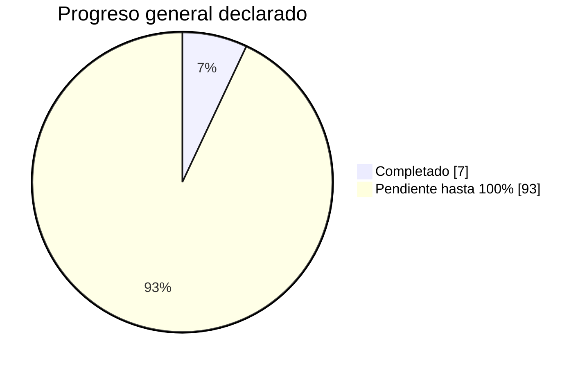
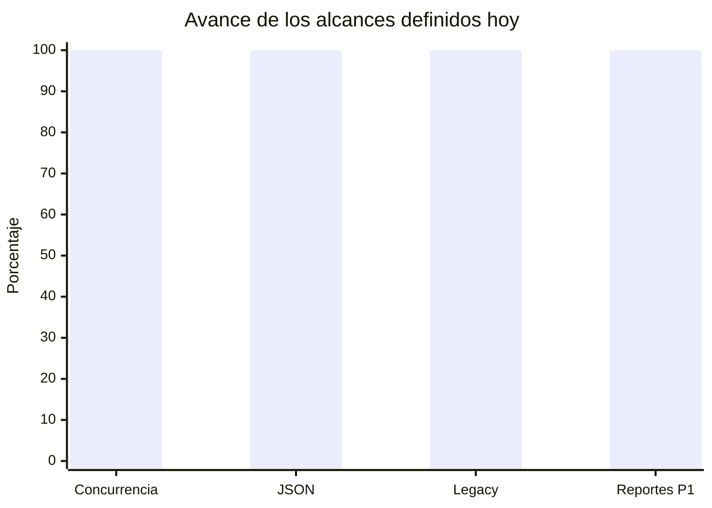
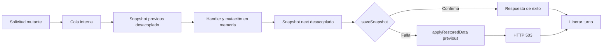
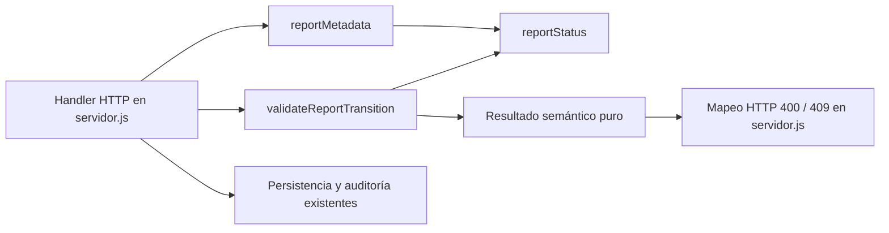

# Cierre formal de sesión — 2026-10-03

**Hora de cierre registrada:** 09:25 (America/Bogota, UTC-05:00)  
**Hora prevista de reanudación:** 18:00  
**Rama:** `main`  
**Estado general declarado del proyecto:** 7%  
**Alcance de la jornada:** cierre del Bloque 50 e inicio controlado del Bloque 51.

## 1. Resumen ejecutivo

La jornada cerró dos resultados verificables. Primero, quedó cerrado el Bloque 50 con una corrección global para impedir interferencias entre mutaciones persistidas concurrentes: las operaciones se serializan, los snapshots `previous` y `next` están desacoplados y el rollback de una solicitud ya no revierte una mutación confirmada por otra. Segundo, quedó completado el Paso 1 del Bloque 51: la normalización de estado, los metadatos y la validación pura de transiciones de Reportes salieron de `servidor.js` hacia `servidor/dominio/reportes.js`, conservando los contratos HTTP existentes.

La suite completa, las pruebas específicas de Reportes y concurrencia, las comprobaciones de sintaxis y `git diff --check` terminaron correctamente. No se hizo push, no se modificó MySQL operacional y no se inició el Paso 2 de Reportes.

Commits técnicos y documentales de la jornada:

| Hora | Commit | Propósito |
|---|---|---|
| 09:06 | `2726342` | Serialización de persistencia y rollback concurrente seguro |
| 09:07 | `5b6a93e` | Registro documental del cierre del Bloque 50 |
| 09:15 | `d0bb011` | Extracción de estado, metadatos y transiciones de Reportes |
| 09:16 | `f520983` | Registro documental del Paso 1 del Bloque 51 |

## 2. Timeline de la jornada

```mermaid
timeline
    title Jornada técnica del 2026-10-03
    Antes de 09:06 : Auditoría del estado compartido y rollback
                    : Reproducción controlada de concurrencia
                    : Verificación de copia JSON y modo legacy
    09:06 : Commit técnico del Bloque 50 (2726342)
          : Cola de mutaciones y snapshots estables
    09:07 : Commit documental del Bloque 50 (5b6a93e)
    09:15 : Commit técnico del Paso 1 de Reportes (d0bb011)
          : Dominio puro para estado, metadatos y transiciones
    09:16 : Commit documental del Bloque 51 (f520983)
    09:25 : Cierre formal y reporte de sesión
    18:00 : Reanudación prevista
```

Las actividades anteriores a las 09:06 están comprobadas por las pruebas y el historial técnico, pero Git no permite asignarles una hora inicial exacta. No se atribuye una duración inventada.

## 3. Progreso en porcentaje

### Progreso general del proyecto

```text
Actual    7%  [███░░░░░░░░░░░░░░░░░░░░░░░░░░░░░░░░░░░░░]  Meta: 100%
Restante 93%  [█████████████████████████████████████░░░]
```



El 7% es la línea base general indicada para este cierre; no se recalculó a partir del número de archivos o commits.

### Desglose por módulo o alcance trabajado hoy

| Módulo / alcance | Progreso del alcance definido | Estado |
|---|---:|---|
| Bloque 50 — consistencia concurrente | 100% | Cerrado |
| Prueba concurrente A confirma / B falla | 100% | Verificada |
| Prueba concurrente A falla / B confirma | 100% | Verificada |
| Compatibilidad de copia profunda JSON | 100% | Verificada |
| Modo legacy de Reportes | 100% | Verificado |
| Bloque 51 — Paso 1, estado y metadatos | 100% | Cerrado |
| Bloque 51 completo | No calculable aún | En desarrollo; los pasos restantes no están estimados |
| Proyecto completo | 7% | Línea base declarada |



## 4. Arquitectura backend fundamental

### Persistencia global después del Bloque 50



La sección crítica abarca captura previa, handler, snapshot posterior, persistencia, confirmación o rollback y liberación. Los errores no dejan la cola bloqueada. El modo legacy conserva su secuencia síncrona desde la mutación hasta la escritura y respuesta.

### Reportes después del Paso 1



Responsabilidades actuales:

- `servidor/dominio/reportes.js`: estado normalizado, metadatos y validación pura de transiciones.
- `servidor/servidor.js`: lectura HTTP, mensajes y códigos HTTP, mutación, auditoría y persistencia.
- `servidor/modulos/reporte_pdf.js`: generación PDF, sin cambios hoy.
- Repositorio y snapshot global: persistencia serializada, sin cambios durante el Paso 1.

No quedaron comparaciones directas de `report.status` con `active` o `archived` fuera del dominio. La política de retención continúa usando `reportStatus(report) === "archived"`, por lo que consume la abstracción sin duplicarla.

## 5. Pruebas y balance

### Estado de pruebas

| Validación | Estado | Resultado |
|---|:---:|---|
| `node --check servidor/dominio/reportes.js` | ✅ | Pasa |
| `node --check servidor/servidor.js` | ✅ | Pasa |
| Prueba unitaria del dominio de Reportes | ✅ | Pasa dentro de `pruebas/prueba_modulos.js` |
| `npm run test:reports` | ✅ | Pasa |
| `npm run test:persistence-concurrency` | ✅ | Pasa ambos órdenes de confirmación/fallo |
| `npm test` | ✅ | Código de salida 0 |
| `git diff --check` | ✅ | Sin errores |
| Pruebas del Paso 2 de Reportes | ⏳ | Pendientes porque el paso no comenzó |
| Pruebas sobre consistencia estricta de GET concurrentes | ⏳ | Riesgo residual documentado, fuera del Bloque 50 |
| Pruebas fallando conocidas | ❌ | Ninguna al cierre |

### Balance de inversión y entrega

| Métrica | Balance trazable |
|---|---|
| Ventana temporal observable en Git | 09:06–09:25: 19 minutos, aproximadamente 0,32 horas |
| Tiempo anterior de análisis y pruebas | No cuantificable con precisión a partir de Git |
| Código técnico entregado | 2 commits técnicos |
| Documentación entregada | 2 commits documentales más este reporte de cierre |
| Funcionalidad principal | Rollback concurrente aislado y dominio inicial de Reportes |
| Cobertura de regresión | Suite completa y dos pruebas específicas aprobadas |
| Incidentes abiertos introducidos hoy | Ninguno conocido |

El balance no pretende convertir líneas de código en productividad. La entrega relevante es la garantía de consistencia concurrente, acompañada de una primera extracción de Reportes con contratos conservados y regresión automatizada.

## 6. Pendientes / roadmap

Prioridad al reanudar a las 18:00:

1. Revisar y aprobar el alcance exacto del Paso 2 del Bloque 51.
2. Mantener fuera del siguiente cambio la persistencia global ya cerrada, salvo que aparezca una regresión demostrable.
3. Continuar la extracción de Reportes de forma cohesiva, sin mover handlers completos ni introducir capas innecesarias.
4. Definir pruebas antes de cada extracción posterior y conservar los contratos HTTP actuales.
5. Decidir en un trabajo independiente si las lecturas GET deben quedar aisladas de mutaciones aún no confirmadas.
6. Hacer push únicamente cuando exista autorización explícita.

### QUÉ FALTA PARA TERMINAR

- [ ] Autorizar y definir el Paso 2 del Bloque 51.
- [ ] Ejecutar las extracciones restantes de Reportes, una por paso aprobado.
- [ ] Validar cada paso con pruebas unitarias, `test:reports`, concurrencia y suite completa.
- [ ] Cerrar formalmente el Bloque 51 cuando todos sus pasos estén aprobados.
- [ ] Evaluar el riesgo residual de GET concurrentes como trabajo independiente.
- [ ] Completar el 93% restante de la línea base general del proyecto conforme al roadmap aún por definir.
- [ ] Autorizar y ejecutar el push de los commits locales cuando corresponda.

### QUÉ QUEDÓ FUNCIONANDO HOY

- [x] Mutaciones persistidas serializadas mediante una cola interna.
- [x] Snapshots `previous` y `next` estables y desacoplados.
- [x] Rollback concurrente sin revertir la operación confirmada de otra solicitud.
- [x] Cola recuperable después de respuestas 4xx y fallos de `saveSnapshot()`.
- [x] Copia profunda JSON verificada con las colecciones reales del snapshot.
- [x] Modo legacy verificado sin una ventana asíncrona equivalente.
- [x] `reportStatus()`, `reportMetadata()` y validación de transiciones en el dominio de Reportes.
- [x] Mapeo HTTP 400/409 conservado en `servidor.js`.
- [x] Suite completa y pruebas específicas aprobadas.
- [x] Historial técnico actualizado hasta el Paso 1 del Bloque 51.

### QUÉ QUEDÓ A MEDIAS / ROTO

- **A medias:** el Bloque 51 continúa en desarrollo; solo su Paso 1 está cerrado.
- **A medias:** el Paso 2 todavía no está definido ni iniciado.
- **Riesgo residual conocido:** un GET concurrente puede observar temporalmente una mutación en memoria antes de que `saveSnapshot()` confirme; quedó documentado y fuera del alcance cerrado.
- **Roto al cierre:** no hay fallos reproducidos ni pruebas fallando conocidas.

## Estado Git al preparar el cierre

Los archivos no rastreados `MEJORAS_HOY_2026-10-02.md` y `git_proceso_Sistema.md` eran preexistentes y se mantuvieron deliberadamente fuera de los commits de la jornada. No se hizo push.
